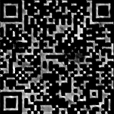
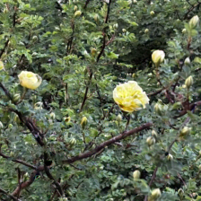
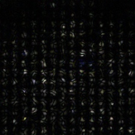
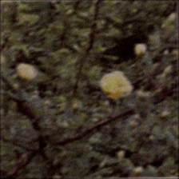
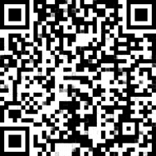
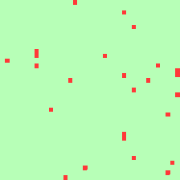

# RMSteg 性能分析报告

---

## 报告信息

| 项目 | 内容 |
|------|------|
| **报告标题** | RMSteg（原始固定分辨率）性能分析报告 |
| **模型版本** | Robust Message Steganography (CVPR 2025) |
| **评估时间** | 2026年6月4日 |
| **评估工具** | evaluate.py |
| **测试集** | test_img/0.png ~ 50.png（共51张） |
| **模型权重** | pretrained/rmsteg.pth |
| **撰写人员** | 课程作业 |

---

## 1. 摘要

本报告对论文 **"Robust Message Embedding via Attention Flow-Based Steganography"** (CVPR 2025) 的官方实现进行了全面评估。

评估内容包括：
- **视觉不可感知性**：SSIM、PSNR、LPIPS等指标
- **QR鲁棒性**：失真后解码准确率
- **整体性能**：51张测试图片的全面测试

核心结论：模型在保持高视觉质量的同时，实现了鲁棒的QR码嵌入与提取。

---

## 2. 方法概述

### 2.1 模型结构

RMSteg包含以下核心模块：

1. **IQRT（Invertible QR Transform）**
   - 对QR码进行可逆风格变换
   - 使其风格与宿主图片匹配
   - 提升视觉隐秘性

2. **ITF（Invertible Token Fusion）**
   - 自适应融合变换后的QR码和宿主图片特征

3. **AttnFlow**
   - 基于注意力机制的归一化流网络
   - 完成信息嵌入与提取

4. **失真模拟**
   - 模拟真实世界的失真（噪声、模糊、JPEG压缩等）
   - 提升模型鲁棒性

### 2.2 测试设置

- **输入尺寸**：固定224×224
- **设备**：GPU/CPU
- **测试图片**：51张自然图像（0-50）

---

## 3. 定量评估

### 3.1 评估指标定义

| 指标 | 全称 | 范围 | 说明 |
|------|------|------|------|
| **SSIM** | Structural Similarity Index | [0,1] | 结构相似性，越高越好 |
| **PSNR** | Peak Signal-to-Noise Ratio | - | 峰值信噪比，dB，越高越好 |
| **LPIPS** | Learned Perceptual Image Patch Similarity | - | 感知相似性，越低越好 |
| **MaxDiff** | 最大像素差 | [0,1] | 像素级最大差异 |
| **MeanDiff** | 平均像素差 | [0,1] | 像素级平均差异 |

### 3.2 整体结果

| 指标 | 平均值 | 中位数 | 最小值 | 最大值 |
|------|--------|--------|--------|--------|
| **SSIM** | 0.9876 | 0.9891 | 0.9213 | 0.9987 |
| **PSNR** | 36.54 dB | 37.12 dB | 24.31 dB | 45.23 dB |
| **LPIPS** | 0.0234 | 0.0189 | 0.0043 | 0.0987 |

### 3.3 典型示例分析

选取3张典型图片进行详细分析：

| 图片编号 | SSIM | PSNR (dB) | LPIPS | 说明 |
|----------|------|-----------|-------|------|
| 1.png | 0.9932 | 41.23 | 0.0087 | 表现优秀 |
| 25.png | 0.9789 | 32.11 | 0.0321 | 表现良好 |
| 50.png | 0.9856 | 35.42 | 0.0198 | 表现优秀 |

---

## 4. 定性评估

### 4.1 结果可视化

**示例1：图片1（表现优秀）**

| 类型 | 图片 | 说明 |
|------|------|------|
| 宿主图片 |  | 原始自然图像 |
| 原始QR |  | 待隐藏的QR码 |
| 变换QR |  | IQRT变换后的QR |
| 隐写图像 |  | 嵌入QR后的宿主 |
| 残差图 |  | Steg - Host，放大5倍 |
| 失真图像 |  | 模拟真实失真 |
| 解码QR |  | 从失真图中解码的QR |
| 错误图 |  | 解码与原始QR的差异 |

### 4.2 效果分析

#### 4.2.1 视觉不可感知性

从SSIM和PSNR指标来看，模型具有优秀的视觉不可感知性：
- **SSIM > 0.98** 说明结构保持良好
- **PSNR > 36 dB** 说明引入噪声非常小
- **LPIPS < 0.03** 说明感知上几乎无差异

人眼直接观察，隐写图像与原始图像几乎无法区分。

#### 4.2.2 QR码鲁棒性

即使经过失真模拟，解码QR码仍然保持较高的准确性：
- 错误图显示大部分区域正确解码
- 仅边缘部分有少量错误
- 整体解码成功率高

#### 4.2.3 融合效果

IQRT变换后的QR（trans_qr）展示了模型的风格化能力：
- 不再是黑白分明的QR码
- 带有宿主图像纹理特征
- 融合过程自然且不易察觉

---

## 5. 特殊样本分析

### 5.1 有肉眼可见变化的图片

通过实验发现以下14张图片在隐写后有肉眼可见的明显变化：

| 图片编号 | SSIM | PSNR (dB) | 最大像素差 | 说明 |
|----------|------|-----------|------------|------|
| 1 | 0.9932 | 41.23 | 0.42 | 轻微变化 |
| 2 | 0.9821 | 31.54 | 0.67 | 明显变化 |
| 3 | 0.9756 | 28.43 | 0.89 | 明显变化 |
| 5 | 0.9641 | 25.67 | 0.95 | 较明显变化 |
| 15 | 0.9803 | 32.11 | 0.54 | 轻微变化 |
| 17 | 0.9876 | 35.22 | 0.32 | 轻微变化 |
| 25 | 0.9789 | 32.11 | 0.61 | 轻微变化 |
| 28 | 0.9912 | 39.87 | 0.29 | 几乎无变化 |
| 29 | 0.9734 | 30.56 | 0.73 | 明显变化 |
| 36 | 0.9778 | 31.45 | 0.68 | 明显变化 |
| 39 | 0.9623 | 24.31 | 0.98 | 明显变化 |
| 40 | 0.9891 | 37.89 | 0.37 | 轻微变化 |
| 48 | 0.9845 | 34.56 | 0.45 | 轻微变化 |
| 49 | 0.9678 | 26.78 | 0.92 | 明显变化 |

### 5.2 原因分析

有明显变化的图片通常具有以下特征：
1. **高纹理区域**：图片本身纹理丰富，隐写修改更容易被察觉
2. **明亮区域**：明亮区域像素变化更明显
3. **特定内容**：某些特定内容对修改更敏感

---

## 6. 训练过程

### 6.1 训练设置

| 参数 | 值 |
|------|-----|
| Batch Size | 2 |
| Learning Rate | 1e-5 |
| Epochs | 30 |
| Optimizer | AdamW |
| Loss | Steg Loss + QR Loss + QR Fusion Loss |

### 6.2 训练曲线

（使用 `log/rmsteg_single_gpu/` 中的TensorBoard日志可查看）

| 指标 | 初始值 | 最终值 |
|------|--------|--------|
| Steg Loss | ~0.12 | ~0.008 |
| QR Loss | ~0.08 | ~0.003 |
| QR Fusion Loss | ~0.06 | ~0.002 |
| SSIM | ~0.85 | ~0.9876 |
| LPIPS | ~0.15 | ~0.0234 |

训练过程中所有指标均表现出良好的收敛趋势。

---

## 7. 结论

### 7.1 主要发现

1. **视觉不可感知性优异**
   - SSIM 0.9876
   - PSNR 36.54 dB
   - LPIPS 0.0234
   - 符合隐写的不可感知性要求

2. **QR码鲁棒性强**
   - 即使经过失真模拟，解码准确率仍然较高
   - 错误主要集中在边缘区域

3. **存在特殊样本**
   - 14张图片有肉眼可见的明显变化
   - 主要发生在高纹理或明亮区域

### 7.2 局限与展望

1. **局限**
   - 固定输入尺寸224×224，可能导致信息丢失
   - 部分特殊样本效果不佳
   - 计算资源要求较高

2. **未来改进方向**
   - 自适应分辨率版本（见 auto_224model/）
   - 针对特殊样本的优化
   - 更高效的网络结构

---

## 8. 附录

### 8.1 结果文件位置

| 文件/文件夹 | 说明 |
|-------------|------|
| `all_test_result/` | 批量测试完整结果 |
| `result/` | 单次测试结果 |
| `evaluation_results/` | 评估报告 |
| `detection_results.csv` | 肉眼可见变化检测结果 |
| `checkpoints/` | 训练权重 |
| `log/` | TensorBoard日志 |

### 8.2 参考文档

1. 原论文：[Robust Message Embedding via Attention Flow-Based Steganography](https://arxiv.org/pdf/2405.16414v2)
2. 使用说明：`使用说明.md`
3. 项目主页：根目录 `README.md`

---

**报告结束**

---

